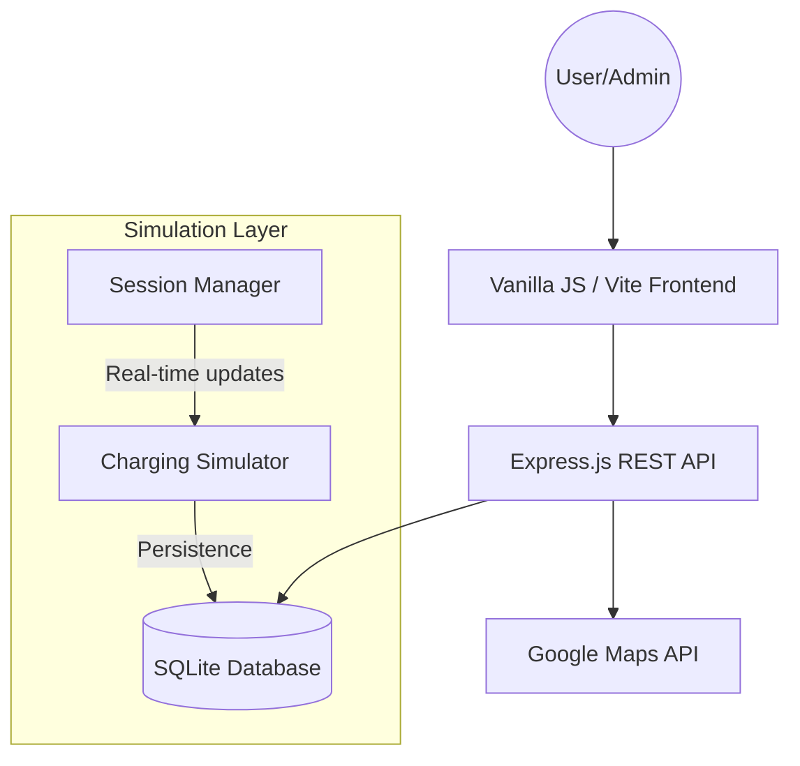

# EV Charging Station Network Management System
[](https://nodejs.org/)
[](https://vitejs.dev/)
[](https://www.sqlite.org/)
[](https://opensource.org/licenses/MIT)

A robust, full-stack management solution for electric vehicle charging infrastructure. This system was developed as a finalized prototype for the Fundamentals of Software Engineering (FSE) course, focusing on real-time hardware simulation, geospatial search, and secure transactional integrity.

---

## 📑 Table of Contents
- [System Architecture](#-system-architecture)
- [Key Modules](#-key-modules)
- [Design Philosophy](#-design-philosophy)
- [Installation & Setup](#-installation--setup)
- [Requirements Traceability](#-requirements-traceability)
- [Hardware Simulation Logic](#-hardware-simulation-logic)

---

## 🏗 System Architecture

The application follows a modular monolith architecture with a clear separation between the hardware simulation layer and the user interaction layer.



---

## 🚀 Key Modules

### 1. Geospatial Station Discovery
Integrated with the **Google Maps JavaScript API**, the system provides a high-performance map interface for İzmir-based stations.
*   **Dynamic Markers**: Filterable by power output (kW), connector types (CCS, Type 2), and current occupancy.
*   **Routing Engine**: Native turn-by-turn navigation overlay using the Directions Service.
*   **Distance Heuristics**: Automatic calculation of Haversine distance from the user's geolocated position.

### 2. Transactional Reservation Engine
A multi-stage booking system designed to prevent race conditions and double-booking.
*   **Eligibility Validation**: Enforces vehicle-to-charger hardware compatibility checks.
*   **Booking Rules**: Implements strict business logic (24h advance limit, 2h session maximum).
*   **Holding Fees**: Automated ₺20.00 escrow-style holding fee logic to reduce "no-show" instances.

### 3. Professional Admin Analytics
A dedicated management portal for network oversight and business intelligence.
*   **Live Metrics**: Revenue summaries, energy consumption totals, and vehicle registration growth.
*   **Utilization Heatmaps**: Analysis of peak hours and station-specific demand.
*   **Hardware Control**: remote maintenance toggle ("Out of Service" mode) which triggers automatic reservation cancellations and user refunds.

---

## 🎨 Design Philosophy

The user interface was engineered to meet the visual standards of modern SaaS platforms (e.g., Linear, Vercel).
*   **Color Palette**: Deep Navy (`#0B1121`) for surfaces to reduce eye strain, accented with Electric Green (`#34D399`) for high-priority interactive elements.
*   **Iconography**: Standardized vector set using **Phosphor Icons**.
*   **Feedback Loops**: Optimized toast notification system and real-time charging progress bars (1Hz update frequency).

---

## 🛠 Installation & Setup

### Environment Configuration
The system requires a Google Maps API Key with **Maps JavaScript API**, **Directions API**, and **Places API** enabled.

1.  **Clone & Install**
    ```bash
    git clone [repo-link]
    cd FSE
    npm install
    ```

2.  **Environment Setup**
    Create a `.env` file in the root:
    ```env
    GOOGLE_MAPS_API_KEY=AIza...
    PORT=3000
    ```

3.  **Run Development Environment**
    ```bash
    npm run dev
    ```

---

## 📊 Requirements Traceability

The project directly addresses the 66 requirements outlined in the `GROUP29 (1).txt` document.

| Req ID | Feature | Implementation Status |
| :--- | :--- | :--- |
| R1-R4 | Station Database & Map | ✅ Fully Implemented |
| R10 | Holding Fee / Wallet | ✅ Fully Implemented |
| R34 | Compatibility Check | ✅ Automated Logic |
| R43 | Plate Uniqueness | ✅ Database Constraint |
| R52 | Audit Logs | ✅ Implementation Ready |
| R55 | Dynamic Pricing | 🛠 Schema Ready |

---

## ⚡ Hardware Simulation Logic

Since physical OCPP (Open Charge Point Protocol) hardware is unavailable for this prototype, the system includes a **High-Fidelity Software Simulator**:
*   **Charging Curve**: Simulates linear power delivery based on station kW and vehicle battery capacity.
*   **Time Dilation**: For demonstration purposes, charging speed is accelerated to show 0-100% progress within a manageable timeframe.
*   **Billing Resolution**: Costs are calculated at the end of the session based on simulated kWh consumption, ensuring accuracy in the wallet/financial subsystem.

---

## 👨‍💻 Contributors
*   **Group 29** - Ege University, Fundamentals of Software Engineering.
