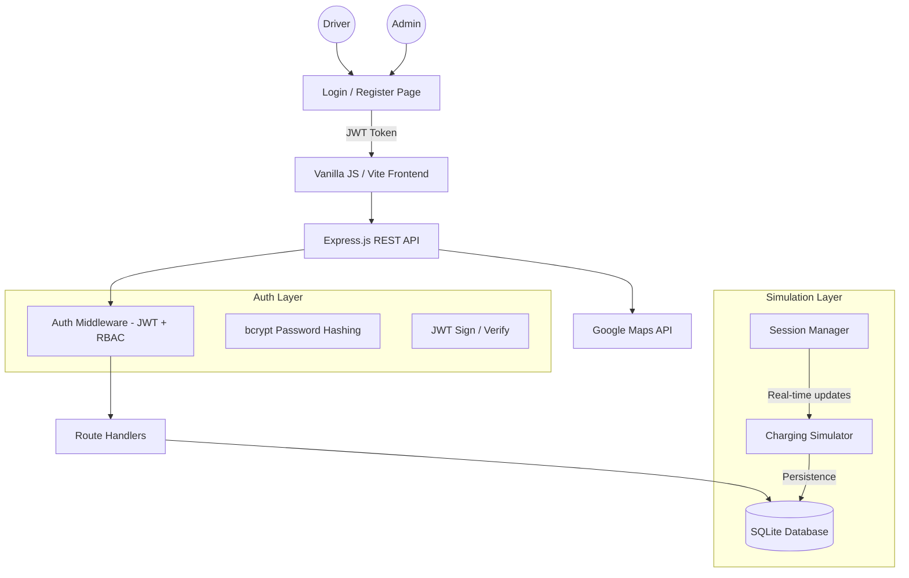

# EV Charging Station Network Management System
[](https://nodejs.org/)
[](https://vitejs.dev/)
[](https://www.sqlite.org/)
[](https://jwt.io/)
[]()
[](https://opensource.org/licenses/MIT)

A robust, full-stack management solution for electric vehicle charging infrastructure. This system was developed as a finalized prototype for the Fundamentals of Software Engineering (FSE) course, featuring **JWT-based authentication**, per-user data isolation, role-based access control, real-time hardware simulation, geospatial search, and secure transactional integrity.

---

## 📑 Table of Contents
- [System Architecture](#-system-architecture)
- [Key Modules](#-key-modules)
- [Design Philosophy](#-design-philosophy)
- [Installation & Setup](#-installation--setup)
- [Testing & Quality Assurance](#-testing--quality-assurance)
- [Requirements Traceability](#-requirements-traceability)
- [Hardware Simulation Logic](#-hardware-simulation-logic)
- [Default Credentials](#-default-credentials)

---

## 🏗 System Architecture

The application follows a modular monolith architecture with a clear separation between the hardware simulation layer and the user interaction layer.



---

## 🚀 Key Modules

### 1. User Authentication & Role-Based Access Control
A complete multi-user authentication system with strict separation between driver and admin interfaces.
*   **Registration & Login**: Tabbed UI with form validation, password strength indicator, and demo credential quick-fill buttons.
*   **JWT Sessions**: Stateless authentication using JSON Web Tokens (24h expiry). Tokens are stored in `localStorage` and auto-attached to API requests.
*   **Password Security**: All passwords hashed with `bcryptjs` (cost factor 12). Raw passwords are never stored.
*   **Role Enforcement**: `authMiddleware` verifies tokens on every protected route. `requireRole('admin')` gates all admin endpoints, returning `403 Forbidden` to non-admin users.
*   **Per-User Data Isolation**: Vehicles, reservations, sessions, wallet balance, and favorites are all scoped to the authenticated `user_id` via foreign keys.
*   **User Menu**: Avatar pill in the navigation bar with dropdown showing username, email, role badge, and sign-out action.

### 2. Geospatial Station Discovery
Integrated with the **Google Maps JavaScript API**, the system provides a high-performance map interface for İzmir-based stations.
*   **Dynamic Markers**: Filterable by power output (kW), connector types (CCS, Type 2), and current occupancy.
*   **Favorites Filter**: Heart toggle on each station detail modal. A toolbar button filters the map/sidebar to show only favorited stations.
*   **Routing Engine**: Native turn-by-turn navigation overlay using the Directions Service.
*   **Distance Heuristics**: Automatic calculation of Haversine distance from the user's geolocated position.

### 3. Transactional Reservation Engine
A multi-stage booking system designed to prevent race conditions and double-booking.
*   **Eligibility Validation**: Enforces vehicle-to-charger hardware compatibility checks.
*   **Booking Rules**: Implements strict business logic (24h advance limit, 2h session maximum).
*   **Holding Fees**: Automated ₺20.00 escrow-style holding fee logic to reduce "no-show" instances.

### 4. Professional Admin Analytics
A dedicated management portal for network oversight and business intelligence. **Only accessible to users with the `admin` role.**
*   **Live Metrics**: Revenue summaries, energy consumption totals, and vehicle registration growth.
*   **Utilization Heatmaps**: Analysis of peak hours and station-specific demand.
*   **User Management**: List all users, change roles (promote/demote), delete accounts.
*   **Hardware Control**: Remote maintenance toggle ("Out of Service" mode) which triggers automatic reservation cancellations and per-user refunds.

## 🎨 Design Philosophy

The user interface follows a **Modern Dark Mode Interface** strategy focusing on physical realism and geometric precision.
*   **Aesthetics**: OLED-optimized pure black (`#000000`) surfaces with vibrant semantic accent colors.
*   **Physics**: Implements "Spring Physics" for all transitions using `cubic-bezier(0.2, 0.8, 0.2, 1)` and a unique "Push-Back" background effect for modals.
*   **Geometry**: Strict adherence to the **8pt Grid System** and "Continuous Corner" (Squircle) geometry for all containers.
*   **Materials**: Advanced use of `backdrop-filter: blur() saturate()` to create premium glassmorphism effects.

---

## 🧪 Testing & Quality Assurance

This project implements a rigorous testing strategy following the methodology prescribed in the course testing documentation (`testing1.md`, `testing2.md`), with **112 automated tests** across three levels:

| Test Suite | File | Tests | Methodology |
| :--- | :--- | :---: | :--- |
| **Unit Tests** | `server/__tests__/api.test.js` | 51 | Partition testing, boundary values, interface validation |
| **Requirements Validation** | `tests/requirements.test.js` | 26 | Requirements-based testing (GROUP29 R1–R44) |
| **UI Unit Tests** | `client/src/__tests__/ui.test.js` | 35 | DOM manipulation, state management, form validation |

### Testing Methodology Coverage
*   **Unit Testing** (testing1.md): Individual API endpoints and UI helpers tested in isolation with valid/invalid input equivalence partitions.
*   **Partition Testing**: Each input field tested with equivalence classes (valid, missing, invalid format, boundary values).
*   **Guideline-Based Testing**: Boundary values exercised (password length 5/6, battery capacity 0/300/301, wallet top-up 10000/10001).
*   **Interface Testing**: Auth headers (missing, invalid, expired), role enforcement (401/403), parameter validation across all endpoints.
*   **Requirements-Based Testing** (testing2.md): Direct mapping to GROUP29 requirements R1, R3–R9, R15–R20, R23, R27–R28, R30, R32–R35, R42–R44.
*   **System/Integration Testing**: Full end-to-end workflows (register → login → create vehicle → start session → calculate cost → end session → verify wallet deduction).
*   **Regression Testing**: All tests are idempotent (timestamp-based unique data) and safe to re-run against a persistent database.

### 📊 Running Tests
```bash
# Run all 112 tests once
npm test

# Watch mode (re-runs on file changes)
npm run test:watch

# Visual dashboard (recommended for presentations)
npm run test:ui

# Coverage report
npm run test:coverage
```

---

## 🛠 Installation & Setup

Follow these steps to get the development environment running locally.

### 📋 Prerequisites
*   **Node.js** (v18.0 or higher recommended)
*   **npm** (comes with Node.js)
*   A **Google Maps API Key** with the following APIs enabled:
    *   Maps JavaScript API
    *   Directions API
    *   Places API

### 1. Clone the Repository
```bash
git clone https://github.com/volkansungar/FSE-PROJECT.git
cd FSE-PROJECT
```

### 2. Install Dependencies
The project consists of a root package (server) and a `client` directory (Vite frontend). You can install everything with a single command:
```bash
npm run setup
```
*Alternatively, you can run `npm install` in the root and then `cd client && npm install`.*

### 3. Environment Configuration
Create a `.env` file in the root directory:
```env
GOOGLE_MAPS_API_KEY=YOUR_ACTUAL_API_KEY_HERE
JWT_SECRET=your-secret-key-change-in-production
PORT=3000
```
> **Note**: `JWT_SECRET` is used to sign authentication tokens. Use a strong, random string in production.

### 4. Database Initialization
The system uses **SQLite**, so no separate database installation is required. The database schema and initial seed data (stations, chargers, default user accounts) will be automatically created the first time you start the server.

### 5. Run the Application
Start both the backend server and the frontend development server concurrently:
```bash
npm run dev
```
*   The **Frontend** will be available at: `http://localhost:5173`
*   The **Backend API** will be available at: `http://localhost:3000`

### 6. Running Tests
To verify the installation and system requirements:
```bash
# Run all tests once
npm test

# Open the visual test dashboard
npm run test:ui
```

---

## 📊 Requirements Traceability

The project directly addresses the 66 requirements outlined in the `GROUP29 (1).txt` document.

| Req ID | Feature | Implementation Status |
| :--- | :--- | :--- |
| R1–R4 | Station Database, Map & Real-time Status | ✅ Fully Implemented |
| R3, R44 | Vehicle Registration & Update | ✅ Fully Implemented |
| R5 | Mark Chargers Out of Service | ✅ Admin Role Enforced |
| R6 | 2h Session Max / 24h Advance Limit | ✅ Validated & Tested |
| R7, R34, R42 | Reservation with Compatibility Check | ✅ Automated Logic |
| R8 | Cost Calculation (kWh × price) | ✅ Tested with Precision |
| R9, R10 | Wallet Top-up & Refund on Cancel | ✅ Per-User Balance |
| R15 | Physical Issue Reporting | ✅ Fully Implemented |
| R16, R17 | Auto-Cancel on Out-of-Service + Refund | ✅ Transactional |
| R18, R19 | Charging History (per-user) | ✅ User-Scoped |
| R20 | Favorite Stations & Marketing Analytics | ✅ Fully Implemented |
| R23 | Low Wallet Balance Alert | ✅ Client-Side Toast |
| R27–R28 | Revenue & Utilization Reports | ✅ Admin Dashboard |
| R30 | User Behavior Summaries | ✅ Admin Stats |
| R32, R35 | Admin Charger/Station Config | ✅ Fully Implemented |
| R33 | Filter by Connector/Power/Favorites | ✅ Map Toolbar |
| R43 | Unique License Plate Constraint | ✅ Database + API |
| R52 | Audit Logs | 🛠 Schema Ready |
| R55 | Dynamic Pricing | 🛠 Schema Ready |

---

## ⚡ Hardware Simulation Logic

Since physical OCPP (Open Charge Point Protocol) hardware is unavailable for this prototype, the system includes a **High-Fidelity Software Simulator**:
*   **Charging Curve**: Simulates linear power delivery based on station kW and vehicle battery capacity.
*   **Time Dilation**: For demonstration purposes, charging speed is accelerated to show 0-100% progress within a manageable timeframe.
*   **Billing Resolution**: Costs are calculated at the end of the session based on simulated kWh consumption, ensuring accuracy in the wallet/financial subsystem.

---

## 🔑 Default Credentials

The database is seeded with two demo accounts on first run:

| Account | Username | Password | Role | Starting Balance |
| :--- | :--- | :--- | :--- | :--- |
| Admin | `admin` | `admin123` | `admin` | ₺99,999 |
| Driver | `driver` | `driver123` | `user` | ₺500 |

> **Tip**: The login page includes quick-fill buttons for both accounts.

---

## 👨‍💻 Contributors
*   **Group 29** - Ege University, Fundamentals of Software Engineering.
