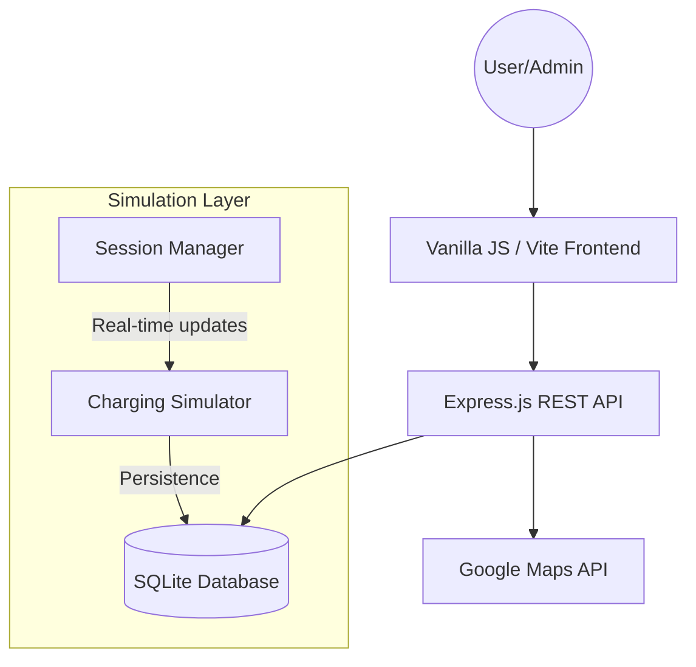

# EV Charging Station Network Management System
[](https://nodejs.org/)
[](https://vitejs.dev/)
[](https://www.sqlite.org/)
[](https://opensource.org/licenses/MIT)

A robust, full-stack management solution for electric vehicle charging infrastructure. This system was developed as a finalized prototype for the Fundamentals of Software Engineering (FSE) course, focusing on real-time hardware simulation, geospatial search, and secure transactional integrity.

---

## 📑 Table of Contents
- [System Architecture](#-system-architecture)
- [Key Modules](#-key-modules)
- [Design Philosophy](#-design-philosophy)
- [Installation & Setup](#-installation--setup)
- [Requirements Traceability](#-requirements-traceability)
- [Hardware Simulation Logic](#-hardware-simulation-logic)

---

## 🏗 System Architecture

The application follows a modular monolith architecture with a clear separation between the hardware simulation layer and the user interaction layer.



---

## 🚀 Key Modules

### 1. Geospatial Station Discovery
Integrated with the **Google Maps JavaScript API**, the system provides a high-performance map interface for İzmir-based stations.
*   **Dynamic Markers**: Filterable by power output (kW), connector types (CCS, Type 2), and current occupancy.
*   **Routing Engine**: Native turn-by-turn navigation overlay using the Directions Service.
*   **Distance Heuristics**: Automatic calculation of Haversine distance from the user's geolocated position.

### 2. Transactional Reservation Engine
A multi-stage booking system designed to prevent race conditions and double-booking.
*   **Eligibility Validation**: Enforces vehicle-to-charger hardware compatibility checks.
*   **Booking Rules**: Implements strict business logic (24h advance limit, 2h session maximum).
*   **Holding Fees**: Automated ₺20.00 escrow-style holding fee logic to reduce "no-show" instances.

### 3. Professional Admin Analytics
A dedicated management portal for network oversight and business intelligence.
*   **Live Metrics**: Revenue summaries, energy consumption totals, and vehicle registration growth.
*   **Utilization Heatmaps**: Analysis of peak hours and station-specific demand.
*   **Hardware Control**: remote maintenance toggle ("Out of Service" mode) which triggers automatic reservation cancellations and user refunds.

## 🎨 Design Philosophy

The user interface follows a **Modern Dark Mode Interface** strategy focusing on physical realism and geometric precision.
*   **Aesthetics**: OLED-optimized pure black (`#000000`) surfaces with vibrant semantic accent colors.
*   **Physics**: Implements "Spring Physics" for all transitions using `cubic-bezier(0.2, 0.8, 0.2, 1)` and a unique "Push-Back" background effect for modals.
*   **Geometry**: Strict adherence to the **8pt Grid System** and "Continuous Corner" (Squircle) geometry for all containers.
*   **Materials**: Advanced use of `backdrop-filter: blur() saturate()` to create premium glassmorphism effects.

---

## 🧪 Testing & Quality Assurance

This project implements a rigorous testing strategy divided into three levels, as specified in the course documentation:

1.  **Unit Testing** (`Vitest + JSDOM`): Validates individual UI helpers and frontend logic in isolation.
2.  **Integration Testing** (`Supertest`): Ensures that API endpoints, database operations, and middle-wares work seamlessly together.
3.  **Requirements Validation** (`tests/requirements.test.js`): A dedicated test suite that maps code behavior directly to official project requirements (R3, R8, R15, R16).

### 📊 Running Tests
*   **Full Suite**: `npm test`
*   **Visual Dashboard**: `npm run test:ui` (Recommended for presentations to show real-time passes).
*   **Coverage Report**: `npm run test:coverage`

---

## 🛠 Installation & Setup

Follow these steps to get the development environment running locally.

### 📋 Prerequisites
*   **Node.js** (v18.0 or higher recommended)
*   **npm** (comes with Node.js)
*   A **Google Maps API Key** with the following APIs enabled:
    *   Maps JavaScript API
    *   Directions API
    *   Places API

### 1. Clone the Repository
```bash
git clone https://github.com/volkansungar/FSE-PROJECT.git
cd FSE-PROJECT
```

### 2. Install Dependencies
The project consists of a root package (server) and a `client` directory (Vite frontend). You can install everything with a single command:
```bash
npm run setup
```
*Alternatively, you can run `npm install` in the root and then `cd client && npm install`.*

### 3. Environment Configuration
Create a `.env` file in the root directory and add your Google Maps API key:
```env
GOOGLE_MAPS_API_KEY=YOUR_ACTUAL_API_KEY_HERE
PORT=3000
```

### 4. Database Initialization
The system uses **SQLite**, so no separate database installation is required. The database schema and initial seed data (stations, chargers, wallet balance) will be automatically created the first time you start the server.

### 5. Run the Application
Start both the backend server and the frontend development server concurrently:
```bash
npm run dev
```
*   The **Frontend** will be available at: `http://localhost:5173`
*   The **Backend API** will be available at: `http://localhost:3000`

### 6. Running Tests
To verify the installation and system requirements:
```bash
# Run all tests once
npm test

# Open the visual test dashboard
npm run test:ui
```

---

## 📊 Requirements Traceability

The project directly addresses the 66 requirements outlined in the `GROUP29 (1).txt` document.

| Req ID | Feature | Implementation Status |
| :--- | :--- | :--- |
| R1-R4 | Station Database & Map | ✅ Fully Implemented |
| R10 | Holding Fee / Wallet | ✅ Fully Implemented |
| R34 | Compatibility Check | ✅ Automated Logic |
| R43 | Plate Uniqueness | ✅ Database Constraint |
| R52 | Audit Logs | ✅ Implementation Ready |
| R55 | Dynamic Pricing | 🛠 Schema Ready |

---

## ⚡ Hardware Simulation Logic

Since physical OCPP (Open Charge Point Protocol) hardware is unavailable for this prototype, the system includes a **High-Fidelity Software Simulator**:
*   **Charging Curve**: Simulates linear power delivery based on station kW and vehicle battery capacity.
*   **Time Dilation**: For demonstration purposes, charging speed is accelerated to show 0-100% progress within a manageable timeframe.
*   **Billing Resolution**: Costs are calculated at the end of the session based on simulated kWh consumption, ensuring accuracy in the wallet/financial subsystem.

---

## 👨‍💻 Contributors
*   **Group 29** - Ege University, Fundamentals of Software Engineering.
